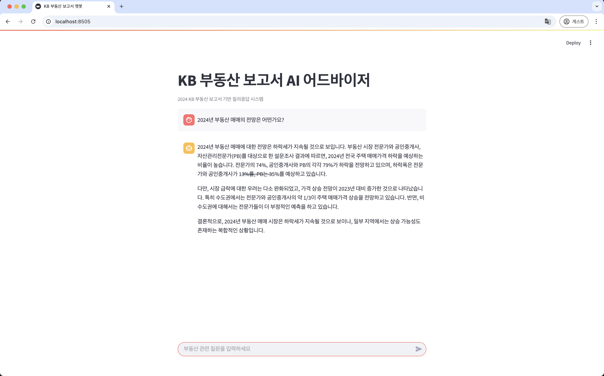

# 🏡 KB 부동산 RAG 챗봇

LangChain과 Streamlit을 활용하여 **2024 KB 부동산 보고서** 기반 질의응답 서비스를 구현한 RAG 챗봇입니다.  
문서를 벡터화하고 검색 가능한 형태로 만들어, 사용자 질문에 대해 실제 문서 기반의 답변을 제공합니다.

---

## 📌 주요 기능

- 📄 **PDF 문서 기반 RAG 구성**  
- 💬 **Streamlit 기반 직관적 챗 UI**  
- 🧠 **LangChain + OpenAI GPT-4o-mini** 활용  
- 🧭 **대화 기록(Session State) 관리**

---

## 🛠️ 사용 기술

| 항목 | 내용 |
|------|------|
| 언어 | Python 3.10+ |
| 주요 라이브러리 | LangChain, Streamlit, OpenAI, Chroma |
| 벡터 DB | ChromaDB |
| LLM | GPT-4o-mini (OpenAI) |

---

## 📂 프로젝트 구조

```
kb-rag-chatbot
┣ data/
┃ ┗ 2024_KB_부동산_보고서_최종.pdf (※ GitHub에는 포함되어 있지 않음)
┣ app.py
┣ .env.example
┣ requirements.txt
┗ README.md
```

---

## 🚀 실행 방법

### 1. 저장소 클론

```bash
git clone https://github.com/woneze/kb-rag-chatbot.git
cd kb-rag-chatbot
```

### 2. 가상환경 설정 (선택)

```bash
python -m venv venv
source venv/bin/activate  # macOS / Linux
venv\Scripts\activate     # Windows
```

### 3. 패키지 설치

```bash
pip install -r requirements.txt
```

### 4. 환경 변수 설정

`.env` 파일 생성:

```env
# .env
OPENAI_API_KEY=your_openai_key_here
```

### 5. Streamlit 실행

```bash
streamlit run app.py
```

---

## 📁 데이터 파일 주의

> 해당 저장소는 **KB 부동산 보고서 PDF 파일을 포함하지 않습니다.**

👇 아래 링크에서 직접 다운로드 후 `data/` 폴더에 넣어주세요:

📥 [2024 KB 부동산 보고서 다운로드](https://www.kbfg.com/kbresearch/report/reportView.do?reportId=2000450)

- 파일명: `2024_KB_부동산_보고서_최종.pdf`
- 위치: `kb-rag-chatbot/data/`

---

## ✨ 미리보기

> 아래는 KB 부동산 보고서 기반 질의응답 예시입니다.



---

## 📚 참고 자료

- [LangChain 공식 문서](https://docs.langchain.com/)
- [OpenAI API 문서](https://platform.openai.com/docs)
- [ChromaDB](https://www.trychroma.com/)
