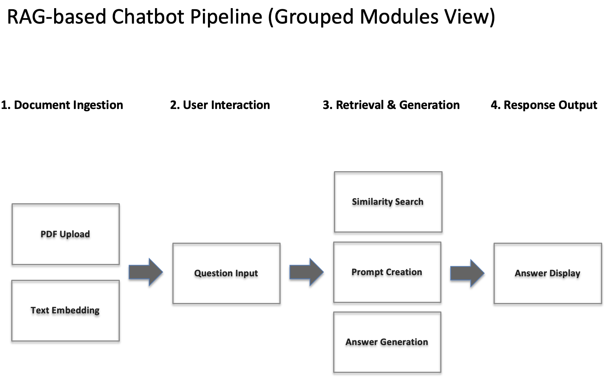
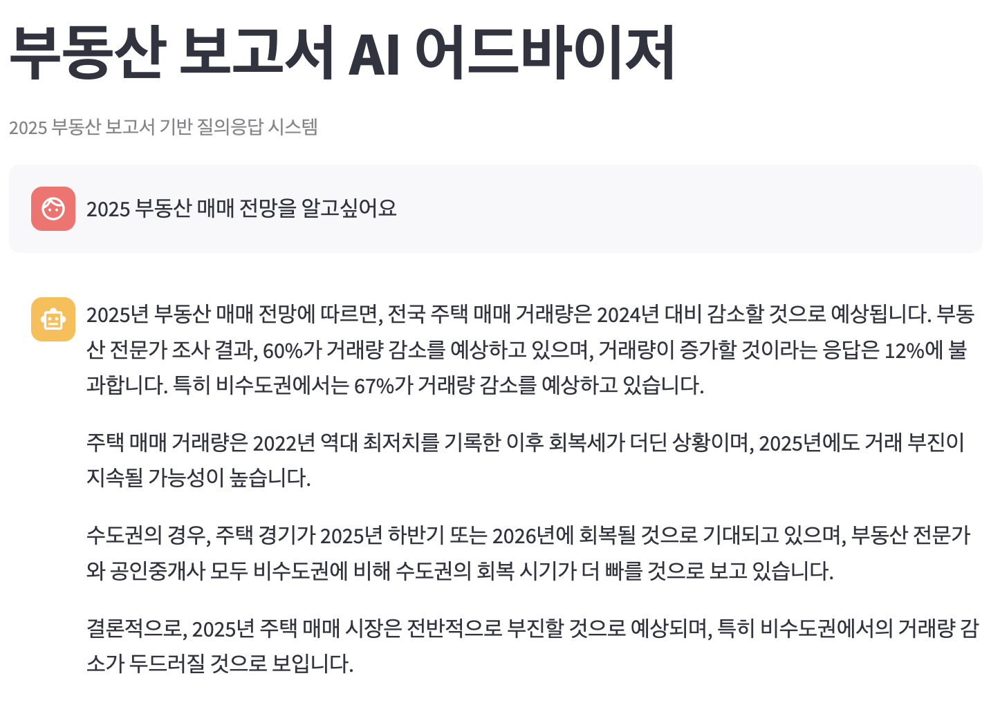

# 🏡 부동산 RAG 챗봇

**2025 부동산 보고서**를 기반으로 질문에 자동으로 응답하는 **RAG(Retrieval-Augmented Generation)** 기반 AI 챗봇입니다.  
PDF 문서에서 지식을 추출하고, 벡터 검색 + GPT-4o-mini 모델을 통해 실시간 질문 응답이 가능합니다.

<p align="center">
  
</p>

---

## 📌 주요 기능

- `PDF` 문서 자동 분석 및 청크 단위 분리
- `OpenAI Embedding` 기반 벡터 생성
- `Chroma` 벡터 DB 저장 및 검색
- `GPT-4o-mini`를 통한 문맥 기반 응답 생성
- `Streamlit` 기반 UI 제공

---

## 🧭 시스템 아키텍처

> 아래 다이어그램은 전체 데이터 흐름 및 처리 과정을 보여줍니다.

- 📄 PDF 문서 → 텍스트 청크 → 벡터 임베딩
- 🗃️ Chroma 벡터 DB 저장
- 💬 사용자 질문 → 유사 문서 검색 → GPT 응답
- 🌐 Streamlit을 통한 결과 표시

---

## 🛠 기술 스택

| 영역 | 사용 기술 |
|------|-----------|
| 문서 로더 | LangChain (PyPDFLoader) |
| 텍스트 분리 | RecursiveCharacterTextSplitter |
| 벡터 임베딩 | OpenAI Embeddings (text-embedding-3-small) |
| 벡터 저장소 | ChromaDB |
| 언어 모델 | OpenAI GPT-4o-mini |
| 인터페이스 | Streamlit |
| 기타 설정 | dotenv, 캐싱, 세션 관리 등 |

---

## 📁 프로젝트 구조

```
📦 real_estate_chatbot/
├── app.py                   
├── data/                    
│   └── 부동산보고서.pdf
├── .env                      
├── requirements.txt
└── README.md        
```

---

## ▶️ 실행 방법

1. **의존성 설치**
   ```bash
   pip install -r requirements.txt
   ```

2. **.env 파일 생성 후 API 키 추가**
   ```env
   OPENAI_API_KEY=sk-xxxx...
   ```

3. **앱 실행**
   ```bash
   streamlit run app.py
   ```

---

## 📸 미리보기 (UI 예시)

<p align="center">
  
</p>

---

## ✅ 사용 예시

- 질문: *"올해 아파트 매매 시장을 어떻게 전망하고 있나요?"*
- 응답: *(보고서의 실제 내용을 기반으로 GPT가 응답)*

---

## 📌 참고

- 보고서 출처: [2025 KB 부동산 보고서](https://www.kbfg.com/kbresearch/report/reportView.do?reportId=2000524)
- Chat Model: GPT-4o-mini (`gpt-4o-mini`)

- [LangChain 공식 문서](https://docs.langchain.com/)
- [OpenAI API 문서](https://platform.openai.com/docs)
- [ChromaDB](https://www.trychroma.com/)
